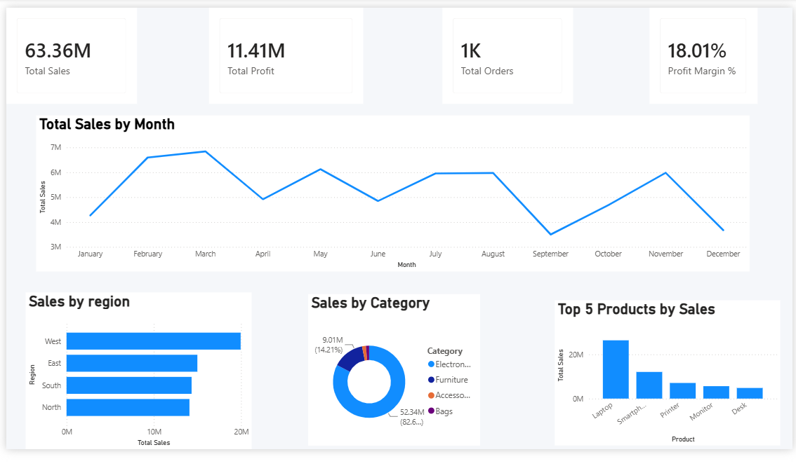
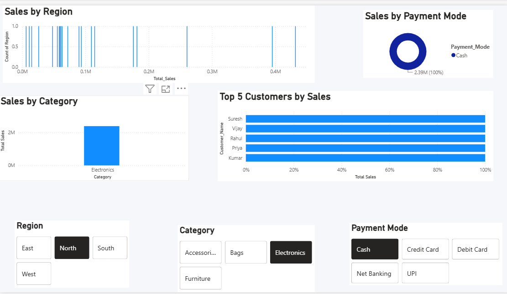
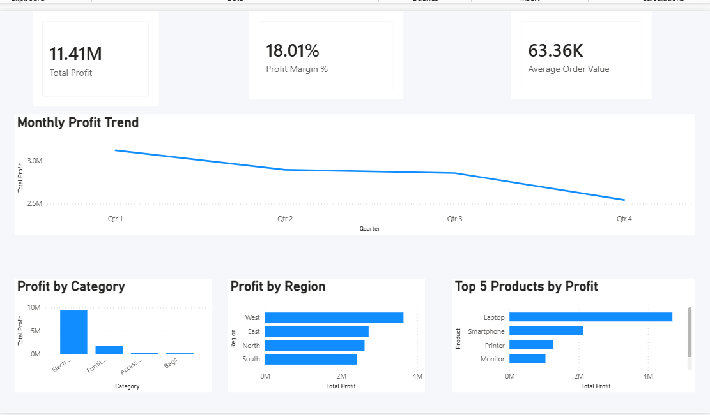
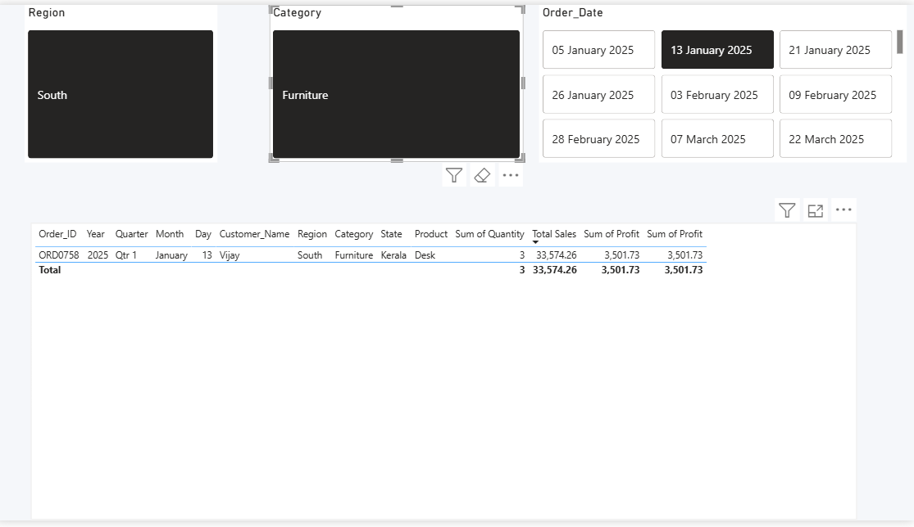

# 📊 Sales & Business Performance Dashboard

## Project Overview

An interactive Sales & Business Performance Dashboard developed using Microsoft Power BI.

## 🎯 Objective

The objective of this project is to analyze sales, profit, customer, product, category, and regional performance using interactive dashboards.

## 🛠️ Tools Used

- Microsoft Power BI
- Microsoft Excel
- Power Query
- DAX

## 📁 Dataset

The dataset contains 1,000 sales records with information about:

- Order ID
- Order Date
- Customer Name
- Region
- State
- Category
- Product
- Quantity
- Unit Price
- Total Sales
- Profit
- Payment Mode

## 📑 Dashboard Pages

### 1. Executive Dashboard

Provides an overall business performance summary using KPI cards, monthly sales trends, regional sales, category sales, and top 5 products.

### 2. Sales Analysis

Analyzes sales performance by region, category, payment mode, customers, and products.

### 3. Profit Analysis

Analyzes total profit, profit margin, monthly profit, category profit, regional profit, and profitable products.

### 4. Detailed Sales

Provides detailed order-level sales information with interactive filtering.

## 🧮 DAX Measures

- Total Sales
- Total Profit
- Total Orders
- Total Quantity
- Profit Margin %
- Average Order Value

## ⭐ Key Features

- Interactive KPI Cards
- Monthly Sales Trend
- Regional Analysis
- Category Analysis
- Profit Analysis
- Top 5 Product Analysis
- Interactive Filters
- Detailed Sales Table

## 📸 Dashboard Screenshots

### Executive Dashboard

### Sales Analysis

### Profit Analysis

### Detailed Sales

## 📌 Conclusion

This Power BI dashboard provides meaningful insights into sales and profitability performance and helps support data-driven business decisions.
